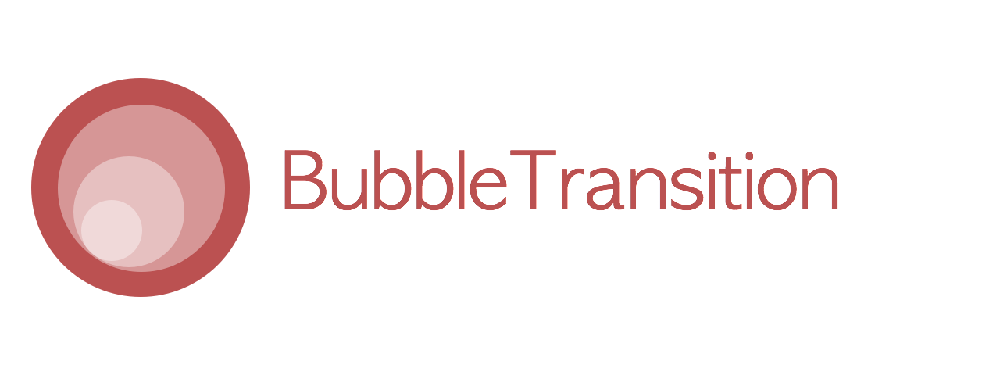

<p align="center">
  
</p>

[](http://cocoapods.org/?q=bubbletransition)
[](https://github.com/Carthage/Carthage)


A custom modal transition that presents and dismiss a controller inside an expanding and shrinking _bubble_.

<p align="center">
  <a href='https://appetize.io/app/tck0418dftyfjxkqrfu34rwt44' alt='Live demo'>
    
  </a>
</p>

# Screenshot


# Usage
Install through [CocoaPods](http://cocoapods.org):
```
pod 'BubbleTransition', '~> 1.0.0'

use_frameworks!
```
Install through [Carthage](https://github.com/Carthage/Carthage):
```
github "andreamazz/BubbleTransition"
```

## Swift 1.2
Version `1.0.0` targets Swift 2, if you are building with version `1.2` checkout the `swift-1.2` branch.
```
pod 'BubbleTransition', git: 'https://github.com/andreamazz/BubbleTransition', branch: 'swift-1.2'

use_frameworks!
```

#Setup
Have your viewcontroller conform to `UIViewControllerTransitioningDelegate`. Set the `transitionMode`, the `startingPoint`, the `bubbleColor` and the `duration`.
```swift
let transition = BubbleTransition()

override func prepareForSegue(segue: UIStoryboardSegue, sender: AnyObject?) {
    let controller = segue.destinationViewController
    controller.transitioningDelegate = self
    controller.modalPresentationStyle = .Custom
}

// MARK: UIViewControllerTransitioningDelegate

func animationControllerForPresentedController(presented: UIViewController, presentingController presenting: UIViewController, sourceController source: UIViewController) -> UIViewControllerAnimatedTransitioning? {
    transition.transitionMode = .Present
    transition.startingPoint = someButton.center
    transition.bubbleColor = someButton.backgroundColor!
    return transition
}

func animationControllerForDismissedController(dismissed: UIViewController) -> UIViewControllerAnimatedTransitioning? {
    transition.transitionMode = .Dismiss
    transition.startingPoint = someButton.center
    transition.bubbleColor = someButton.backgroundColor!
    return transition
}
```

You can find the Objective-C equivalent [here](https://gist.github.com/andreamazz/9b0d6c7db065555ec0d7).

#Properties
```swift
var startingPoint = CGPointZero
```
The point that originates the bubble.

```swift
var duration = 0.5
```
The transition duration.

```swift
var transitionMode: BubbleTranisionMode = .Present
```
The transition direction. Either `.Present`, `.Dismiss` or `.Pop`.

```swift
var bubbleColor: UIColor = .whiteColor()
```
The color of the bubble. Make sure that it matches the destination controller's background color.  

Checkout the sample project for the full implementation.

#Author
[Andrea Mazzini](https://twitter.com/theandreamazz). I'm available for freelance work, feel free to contact me. 

Want to support the development of [these free libraries](https://cocoapods.org/owners/734)? Buy me a coffee ☕️ via [Paypal](https://www.paypal.me/andreamazzini).  

#Contributors
Thanks to [everyone](https://github.com/andreamazz/BubbleTransition/graphs/contributors) kind enough to submit a pull request. 

#MIT License

	Copyright (c) 2015 Andrea Mazzini. All rights reserved.

	Permission is hereby granted, free of charge, to any person obtaining a
	copy of this software and associated documentation files (the "Software"),
	to deal in the Software without restriction, including
	without limitation the rights to use, copy, modify, merge, publish,
	distribute, sublicense, and/or sell copies of the Software, and to
	permit persons to whom the Software is furnished to do so, subject to
	the following conditions:

	The above copyright notice and this permission notice shall be included
	in all copies or substantial portions of the Software.

	THE SOFTWARE IS PROVIDED "AS IS", WITHOUT WARRANTY OF ANY KIND, EXPRESS
	OR IMPLIED, INCLUDING BUT NOT LIMITED TO THE WARRANTIES OF
	MERCHANTABILITY, FITNESS FOR A PARTICULAR PURPOSE AND NONINFRINGEMENT.
	IN NO EVENT SHALL THE AUTHORS OR COPYRIGHT HOLDERS BE LIABLE FOR ANY
	CLAIM, DAMAGES OR OTHER LIABILITY, WHETHER IN AN ACTION OF CONTRACT,
	TORT OR OTHERWISE, ARISING FROM, OUT OF OR IN CONNECTION WITH THE
	SOFTWARE OR THE USE OR OTHER DEALINGS IN THE SOFTWARE.
	
